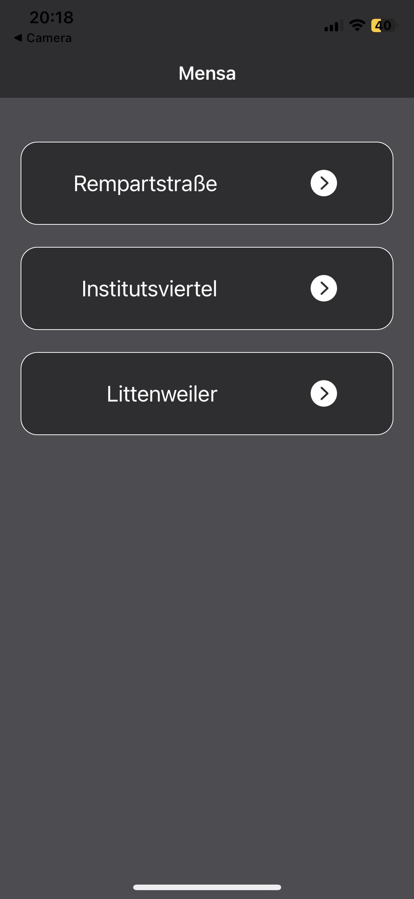
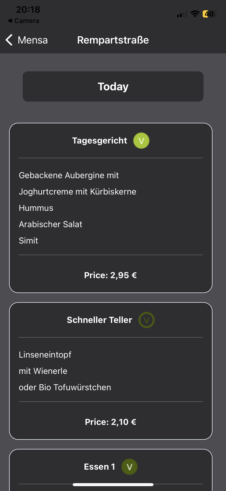

# MyMensa

This is a simple app for getting up-to-date with the mensa food plan at the three big mensas within Freiburg:
- Mensa Rempartstraße
- Mensa Institutsviertel
- Mensa Littenweiler

Since I do not have 99€ per year to spend on the availability of publishing Apps to the App Store for IOS, the apk-file for this app can only be downloaded for Android under the following link:

https://expo.dev/artifacts/eas/cq7g4heKrCrsqBG2hFnxfg.apk

Here are some previews from the app:

    
    

